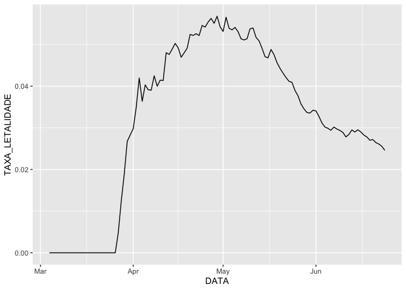

Atividade 10/07
================

``` r
library(tidyverse)

casos <- readr::read_csv2("data-raw/notificacoes-covid19-mg.csv",
                  locale = locale(encoding = "latin1", 
                                  decimal_mark = ",", 
                                  date_format = "%d/%m/%Y"))


obitos <- read_csv2("data-raw/obitos-confirmados-covid19-mg.csv", 
                    locale = locale(encoding = "UTF-8", decimal_mark = ","))

casos_agg <- casos %>% 
  count(DATA_NOTIFICACAO, name = "CASOS_CONF") %>% 
  mutate(CASOS_CONF_ACUMULADO = cumsum(CASOS_CONF)) %>% 
  rename(DATA = DATA_NOTIFICACAO)

obitos_agg <- obitos %>% 
  count(DATA_OBITO, name = "OBITOS_CONF") %>% 
  mutate(OBITOS_CONF_ACUMULADO = cumsum(OBITOS_CONF)) %>% 
  rename(DATA = DATA_OBITO)

df <- left_join(casos_agg, obitos_agg, by = "DATA") %>% 
        fill(OBITOS_CONF_ACUMULADO, .direction = "down") %>% 
        mutate(OBITOS_CONF_ACUMULADO = ifelse(is.na(OBITOS_CONF_ACUMULADO), 
                                              0, 
                                              OBITOS_CONF_ACUMULADO)) %>% 
        mutate(TAXA_LETALIDADE = OBITOS_CONF_ACUMULADO / CASOS_CONF_ACUMULADO)
  
df %>% 
  ggplot() + 
  geom_line(aes(x = DATA, y = TAXA_LETALIDADE))
```

<!-- -->
